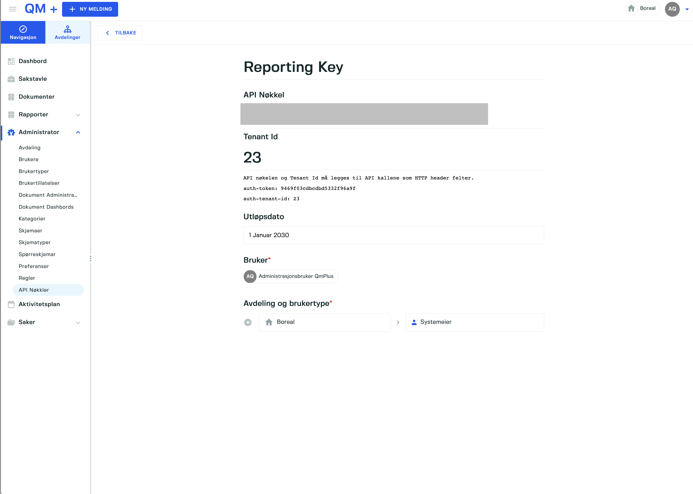

# Retrieve Form Entries and needed data

> REST API documentation can be found at `https://qmplus.app/documentation`

This example deals with how to fetch messages using the REST API and the associated information needed.

## Getting your API key and Tenant Id

Go to the list API tokens and select the correct API key or generate a new one.

The key is tied to the current logged in user, department and user type this controls the 
deparment and access restrictions of the token.

> `Setting up REST calls`
> 
> All requests need the token and tenantId set on the `HTTP header` for the call to work.
>
>| Field | Description |
>| --- | --- |
>| `auth-token` | The auth token from the token page above. |
>| `auth-tenant-id` | The tenant id shown in the token page above. |

## Recommended way to retrieve messages and associated data
We recommend to first get the messages you want from the backend and then access the API to retrieve the needed entities to unpack the messages.

> The reason for this is that for certain types of entities fetching them could take considerable time due to 
> amount of data. Examples of this could be retieve `formVersions` as the return objects can be of significant size.

## Retrieving Messages
Lets focus on how to retrieve messages first. The mechanism to retrive messages is based on the `Expression engine` of the platform that lets you query and transform the data.

Lets look at a query to fetch the latest 30 days of message and then with a custom search range.

> `https://qmplus.app/api/expression/execute?departmentId={departmentId}`
> [API Documentation](https://qmplus.app/swagger-ui/index.html?contextPath=&requestServerName=qmplus.app#/expressions/executeExpression)

The expression API lets use execute a `pipeline` of operations. The HTTP method is `POST`. Below is an
example that shows how to peform a `lAST_30_DAYS` query against `Messages` using a preset.

```js
.post(`/expression/execute?departmentId=${departmentId}`, {
  pipeline: [{
    $select: {
      caseTypeId: { $eq: "1" },
      visibility: visibility,
      registeredOnDate: {
        preset: "LAST_30_DAYS"
      }
    }
  }]
});
```

> **Available presets**
>
> `CUSTOM, THIS_YEAR, TODAY, YESTERDAY, LAST_7_DAYS, LAST_WEEK, LAST_MONTH, LAST_3_MONTHS, LAST_6_MONTHS, LAST_12_MONTHS, LAST_30_DAYS, LAST_90_DAYS, LAST_180_DAYS, LAST_360_DAYS, THIS_WEEK, THIS_MONTH, THIS_HALF_YEAR, THIS_QUARTER, ALL`
>
> **Available caseTypeIds**
>
> | CaseTypeId | Description |
> | --- | --- |
> | `1` | Messages |
> | `2` | Actions |
> | `4` | Audits |
> | `4` | Audits |
> | `5` | Documents |

Below is an expression executing a `CUSTOM` preset query using a star and end date.

```js
.post(`/expression/execute?departmentId=${departmentId}`, {
  pipeline: [{
    $select: {
      caseTypeId: { $eq: "1" },
      visibility: visibility,
      registeredOnDate: {
        preset: "CUSTOM",
        start: {
          $gte: '2022-03-01T00:00:00.000Z'
        }
        end: {
          $lte: '2022-05-31T00:00:00.000Z'
        }
      }
    }
  }]
});
```

## Required Entities
To resolve all the fields in a form entry we need to extract the following entities.

- Category Groups
- Category Versions
- Form Types
- Form Versions
- Priorities
- Risk Models
- Departments
- Workflows

Lets look at each of the entities and how to fetch them.

### Category Group
To fetch category groups we use the following REST API endpoints.

#### `To fetch a specific set of category groups by ids`
> `https://qmplus.app/api/categorygroups/ids?ids=1&ids=2`
> [API Documentation](https://qmplus.app/swagger-ui/index.html?contextPath=&requestServerName=qmplus.app#/categorygroups/getCategoryGroups)

### Category Versions
To fetch the category versions we use the following REST API endpoints.

> `https://qmplus.app/api/categoryversions/ids`
